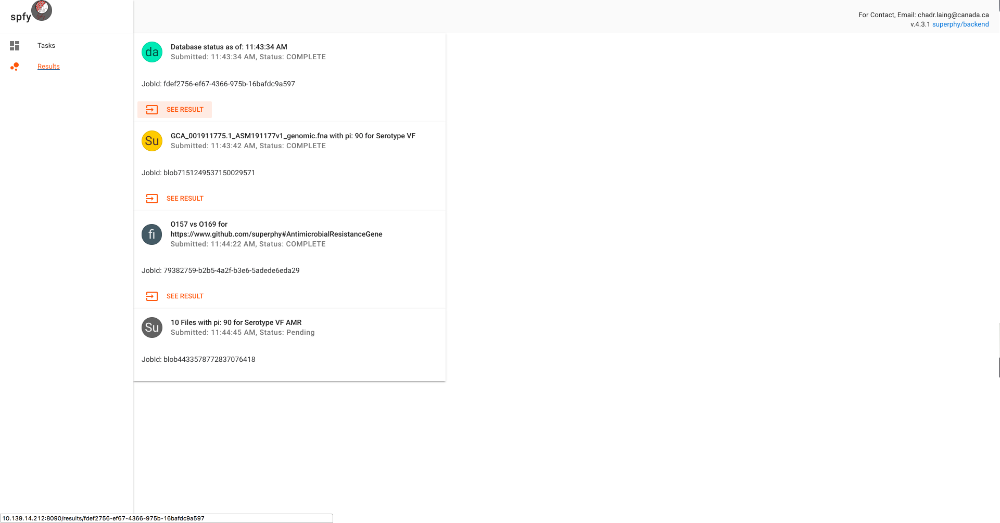

.. tag:intro-begin

|Build Status| |GitHub license| |Docs|

**Spfy**: speedy `superphy <https://github.com/superphy/semantic>`__

Live: https://lfz.corefacility.ca/superphy/grouch/

Platform for predicting Serotype & Virulence Factors (via
`ECTyper <https://github.com/phac-nml/ecoli_serotyping>`__) and
Antimicrobial Resistance (via
`CARD <https://card.mcmaster.ca/analyze/rgi>`__) from E.coli genome
sequences bundled using task queues (RQ) and a SPA front-end
(React/Flask).

Use:
----

1. Install Docker (& Docker-Compose separately if you're on Linux,
   `link <https://docs.docker.com/compose/install/>`__). mac/windows
   users have Compose bundled with Docker Engine.
2. ``git clone --recursive https://github.com/superphy/backend.git``
3. ``cd backend/``
4. ``docker-compose up``
5. Visit http://localhost:8090
6. Eat cake :cake:

.. warning:: There is a option to run all subtyping methods in the background even if the user doesn't select them. This is enabled by DEFAULT. You can disable the option by setting ``BACKLOG_ENABLED = False`` in app/config.py

Architecture:
-------------

+------+------+------+------+
| Dock | Port | Name | Des  |
| er   | s    | s    | crip |
| Imag |      |      | tion |
| e    |      |      |      |
+======+======+======+======+
| back | 80/t | back | the  |
| end- | cp,  | end\ | main |
| rq   | 443/ | _wor | redi |
|      | tcp  | ker\ | s    |
|      |      | _1   | queu |
|      |      |      | e    |
|      |      |      | work |
|      |      |      | ers  |
+------+------+------+------+
| back | 80/t | back | this |
| end- | cp,  | end\ | hand |
| rq-b | 443/ | _wor | les  |
| laze | tcp  | ker- | spfy |
| grap |      | blaz | ID   |
| h    |      | egra | gene |
|      |      | ph-i | rati |
|      |      | ds\_ | on   |
|      |      | 1    | for  |
|      |      |      | the  |
|      |      |      | blaz |
|      |      |      | egra |
|      |      |      | ph   |
|      |      |      | data |
|      |      |      | base |
+------+------+------+------+
| back | 0.0. | back | the  |
| end  | 0.0: | end\ | flas |
|      | 8000 | _web | k    |
|      | ->80 | -ngi | back |
|      | /tcp | nx-u | end  |
|      | ,    | wsgi | whic |
|      | 443/ | \_1  | h    |
|      | tcp  |      | hand |
|      |      |      | les  |
|      |      |      | enqu |
|      |      |      | euei |
|      |      |      | ng   |
|      |      |      | task |
|      |      |      | s    |
+------+------+------+------+
| supe | 0.0. | back | Blaz |
| rphy | 0.0: | end\ | egra |
| /bla | 8080 | _bla | ph   |
| zegr | ->80 | zegr | Data |
| aph: | 80/t | aph\ | base |
| 2.1. | cp   | _1   |      |
| 4-in |      |      |      |
| fere |      |      |      |
| ncin |      |      |      |
| g    |      |      |      |
+------+------+------+------+
| redi | 6379 | back | Redi |
| s:3. | /tcp | end\ | s    |
| 2    |      | _red | Data |
|      |      | is\_ | base |
|      |      | 1    |      |
+------+------+------+------+
| reac | 0.0. | back | fron |
| tapp | 0.0: | end\ | t-en |
|      | 8090 | _rea | d    |
|      | ->50 | ctap | to   |
|      | 00/t | p\_1 | spfy |
|      | cp   |      |      |
+------+------+------+------+

Note: an earlier version of the front-end (written in AngularJS with
limited features) is still available at http://localhost:8000

Further Details:
----------------

The ``superphy/backend-rq:2.0.0`` image is *scalable*: you can create as
many instances as you need/have processing power for. The image is
responsible for listening to the ``multiples`` queue (12 workers) which
handles most of the tasks, including ``RGI`` calls. It also listens to
the ``singles`` queue (1 worker) which runs ``ECTyper``. This is done as
``RGI`` is the slowest part of the equation. Worker management in
handled in ``supervisor``.

The ``superphy/backend-rq-blazegraph:2.0.0`` image is not scalable: it
is responsible for querying the Blazegraph database for duplicate
entries and for assigning spfyIDs in *sequential* order. It's functions
are kept as minimal as possible to improve performance (as ID generation
is the one bottleneck in otherwise parallel pipelines); comparisons are
done by sha1 hashes of the submitted files and non-duplicates have their
IDs reserved by linking the generated spfyID to the file hash. Worker
management in handled in ``supervisor``.

The ``superphy/backend:2.0.0`` which runs the Flask endpoints uses
``supervisor`` to manage inner processes: ``nginx``, ``uWsgi``.

Blazegraph:
-----------

-  We are currently running Blazegraph version 2.1.4. If you want to run
   Blazegraph separately, please use the same version otherwise there
   may be problems in endpoint urls / returns (namely version 2.1.1).
   See `#63 <https://github.com/superphy/backend/issues/63>`__
   Alternatively, modify the endpoint accordingly under
   ``database['blazegraph_url']`` in ``/app/config.py``

CLI: Generate Graph Files:
--------------------------

-  If you wish to only create rdf graphs (serialized as turtle files):

1. First install miniconda and activate the environment from
   https://raw.githubusercontent.com/superphy/docker-flask-conda/master/app/environment.yml
2. cd into the app folder (where RQ workers typically run from):
   ``cd app/``
3. Run savvy.py like so:
   ``python -m modules/savvy -i tests/ecoli/GCA_001894495.1_ASM189449v1_genomic.fna``
   where the argument after the ``-i`` is your genome (FASTA) file.

CLI: Generate Ontology:
-----------------------

The ontology for Spfy is available at:
https://raw.githubusercontent.com/superphy/backend/master/app/scripts/spfy\_ontology.ttl
It was generated using
https://raw.githubusercontent.com/superphy/backend/master/app/scripts/generate\_ontology.py
with shared functions from Spfy's backend code. If you wish to run it,
do: 1. ``cd app/`` 2. ``python -m scripts/generate_ontology`` which will
put the ontology in ``app/``

CLI: Enqueue Subtyping Tasks w/o Reactapp:
------------------------------------------

You can bypass the front-end website and still enqueue subtyping jobs by:

1. First, mount the host directory with all your genome files to ``/datastore`` in the containers.

  For example, if you keep your files at ``/home/bob/ecoli-genomes/``, you'd
  edit the ``docker-compose.yml`` file and replace:

  .. code-block:: yaml

    volumes:
    - /datastore

  with:

  .. code-block:: yaml

    volumes:
    - /home/bob/ecoli-genomes:/datastore

2. Then take down your docker composition (if it's up) and restart it

  .. code-block:: shell

    docker-compose down
    docker-compose up -d

3. Drop and shell into your webserver container (though the worker containers would work too) and run the script.

  .. code-block:: shell

    docker exec -it backend_webserver_1 sh
    python -m scripts/sideload
    exit

Note that reisdues may be created in your genome folder.

Contributing:
-------------

Steps required to add new modules are documented in the `Developer Guide`_.

.. _`Developer Guide`: http://superphy.readthedocs.io/en/latest/contributing.html

.. |Build Status| image:: https://travis-ci.org/superphy/backend.svg?branch=master
   :target: https://travis-ci.org/superphy/backend
.. |GitHub license| image:: https://img.shields.io/badge/license-Apache%202-blue.svg
   :target: https://raw.githubusercontent.com/superphy/backend/master/LICENSE
.. |Docs| image:: https://readthedocs.org/projects/superphy/badge/?version=latest
   :target: http://superphy.readthedocs.io/en/latest/?badge=latest
   :alt: Documentation Status

.. tag:intro-end
